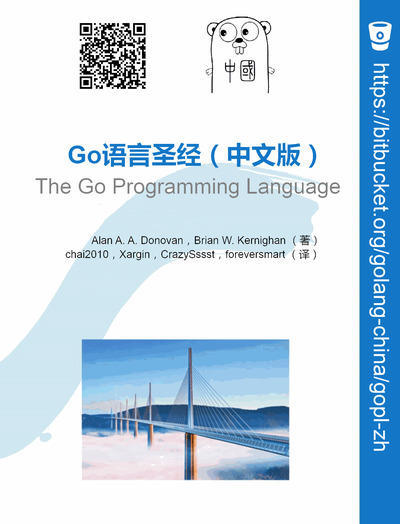

# Go语言圣经（中文版）

Go语言圣经 [《The Go Programming Language》](http://gopl.io) 中文版本，仅供学习交流之用。

- 项目主页：http://github.com/golang-china/gopl-zh
- 项目主页：http://bitbucket.org/golang-china/gopl-zh
- 原版官网：http://gopl.io

在线预览：

- http://gopl-zh.b0.upaiyun.com/
- http://docs.ruanjiadeng.com/gopl-zh/
- http://shifei.me/gopl-zh/
- http://2goo.info/media/html/gopl-zh-gh-pages/
- http://docs.plhwin.com/gopl-zh/



-------

# 译者序

在上个世纪70年代，贝尔实验室的[Ken Thompson][KenThompson]和[Dennis M. Ritchie][DennisRitchie]合作发明了[UNIX](http://doc.cat-v.org/unix/)操作系统，同时[Dennis M. Ritchie][DennisRitchie]为了解决[UNIX](http://doc.cat-v.org/unix/)系统的移植性问题而发明了C语言，贝尔实验室的[UNIX](http://doc.cat-v.org/unix/)和C语言两大发明奠定了整个现代IT行业最重要的软件基础（目前的三大桌面操作系统的中[Linux](http://www.linux.org/)和[Mac OS X](http://www.apple.com/cn/osx/)都是源于[UINX]()系统，两大移动平台的操作系统iOS和Android也都是源于[UNIX](http://doc.cat-v.org/unix/)系统。C系家族的编程语言占据统治地位达几十年之久）。在[UINX]()和C语言发明40年之后，目前已经在Google工作的[Ken Thompson](http://genius.cat-v.org/ken-thompson/)和[Rob Pike](http://genius.cat-v.org/rob-pike/)（他们在贝尔实验室时就是同事）、还有[Robert Griesemer](http://research.google.com/pubs/author96.html)（设计了V8引擎和HotSpot虚拟机）一起合作，为了解决在21世纪多核和网络化环境下越来越复杂的编程问题而发明了Go语言。从Go语言库早期代码库日志可以看出它的演化历程（Git用`git log --before={2008-03-03} --reverse`命令查看）：

从早期提交日志中也可以看出，Go语言是从[Ken Thompson](http://genius.cat-v.org/ken-thompson/)发明的B语言、[Dennis M. Ritchie](http://genius.cat-v.org/dennis-ritchie/)发明的C语言逐步演化过来的，是C语言家族的成员，因此很多人将Go语言称为21世纪的C语言。纵观这几年来的发展趋势，Go语言已经成为云计算、云存储时代最重要的基础编程语言。

在C语言发明之后约5年的时间之后（1978年），[Brian W. Kernighan](http://www.cs.princeton.edu/~bwk/)和[Dennis M. Ritchie](http://genius.cat-v.org/dennis-ritchie/)合作编写出版了C语言方面的经典教材《[The C Programming Language](http://s3-us-west-2.amazonaws.com/belllabs-microsite-dritchie/cbook/index.html)》，该书被誉为C语言程序员的圣经，作者也被大家亲切地称为[K&R](https://en.wikipedia.org/wiki/K%26R)。同样在Go语言正式发布（2009年）约5年之后（2014年开始写作，2015年出版），由Go语言核心团队成员[Alan A. A. Donovan](https://github.com/adonovan)和[K&R](https://en.wikipedia.org/wiki/K%26R)中的[Brian W. Kernighan](http://www.cs.princeton.edu/~bwk/)合作编写了Go语言方面的经典教材《[The Go Programming Language](http://gopl.io)》。Go语言被誉为21世纪的C语言，如果说[K&R](https://en.wikipedia.org/wiki/K%26R)所著的是圣经的旧约，那么D&K所著的必将成为圣经的新约。该书介绍了Go语言几乎全部特性，并且随着语言的深入层层递进，对每个细节都解读得非常细致，每一节内容都精彩不容错过，是广大Gopher的必读书目。大部分Go语言核心团队的成员都参与了该书校对工作，因此该书的质量是可以完全放心的。

同时，单凭阅读和学习其语法结构并不能真正地掌握一门编程语言，必须进行足够多的编程实践——亲自编写一些程序并研究学习别人写的程序。要从利用Go语言良好的特性使得程序模块化，充分利用Go的标准函数库以Go语言自己的风格来编写程序。书中包含了上百个精心挑选的习题，希望大家能先用自己的方式尝试完成习题，然后再参考官方给出的解决方案。

该书英文版约从2015年10月开始公开发售，其中日文版本最早参与翻译和审校（参考致谢部分）。在2015年10月，我们并不知道中文版是否会及时引进、将由哪家出版社引进、引进将由何人来翻译、何时能出版，这些信息都成了一个秘密。中国的Go语言社区是全球最大的Go语言社区，我们从一开始就始终紧跟着Go语言的发展脚步。我们应该也完全有能力以中国Go语言社区的力量同步完成Go语言圣经中文版的翻译工作。与此同时，国内有很多Go语言爱好者也在积极关注该书（本人也在第一时间购买了纸质版本，[亚马逊价格314人民币](http://www.amazon.cn/The-Go-Programming-Language-Donovan-Alan-A-A/dp/0134190440/)。补充：国内也即将出版英文版，[价格79元](http://product.china-pub.com/4912464)）。为了Go语言的学习和交流，大家决定合作免费翻译该书。

翻译工作从2015年11月20日前后开始，到2016年1月底初步完成，前后历时约2个月时间（在其它语言版本中，全球第一个完成翻译的，基本做到和原版同步）。其中，[chai2010](https://github.com/chai2010)翻译了前言、第2~4章、第10~13章，[Xargin](https://github.com/cch123)翻译了第1章、第6章、第8~9章，[CrazySssst](https://github.com/CrazySssst)翻译了第5章，[foreversmart](https://github.com/foreversmart)翻译了第7章，大家共同参与了基本的校验工作，还有其他一些朋友提供了积极的反馈建议。如果大家还有任何问题或建议，可以直接到中文版项目页面提交[Issue](https://github.com/golang-china/gopl-zh/issues)，如果发现英文版原文在[勘误](http://www.gopl.io/errata.html)中未提到的任何错误，可以直接去[英文版项目](https://github.com/adonovan/gopl.io/)提交。

最后，希望这本书能够帮助大家用Go语言快乐地编程。

2016年 1月 于 武汉

-------

# 前言

*“Go是一个开源的编程语言，它很容易用于构建简单、可靠和高效的软件。”（摘自Go语言官方网站：http://golang.org ）*

Go语言由来自Google公司的[Robert Griesemer](http://research.google.com/pubs/author96.html)，[Rob Pike](http://genius.cat-v.org/rob-pike/)和[Ken Thompson](http://genius.cat-v.org/ken-thompson/)三位大牛于2007年9月开始设计和实现，然后于2009年的11月对外正式发布（译注：关于Go语言的创世纪过程请参考 http://talks.golang.org/2015/how-go-was-made.slide ）。语言及其配套工具的设计目标是具有表达力，高效的编译和执行效率，有效地编写高效和健壮的程序。

Go语言有着和C语言类似的语法外表，和C语言一样是专业程序员的必备工具，可以用最小的代价获得最大的战果。
但是它不仅仅是一个更新的C语言。它还从其他语言借鉴了很多好的想法，同时避免引入过度的复杂性。
Go语言中和并发编程相关的特性是全新的也是有效的，同时对数据抽象和面向对象编程的支持也很灵活。
Go语言同时还集成了自动垃圾收集技术用于更好地管理内存。

Go语言尤其适合编写网络服务相关基础设施，同时也适合开发一些工具软件和系统软件。
但是Go语言确实是一个通用的编程语言，它也可以用在图形图像驱动编程、移动应用程序开发
和机器学习等诸多领域。目前Go语言已经成为受欢迎的作为无类型的脚本语言的替代者：
因为Go编写的程序通常比脚本语言运行的更快也更安全，而且很少会发生意外的类型错误。

Go语言还是一个开源的项目，可以免费获编译器、库、配套工具的源代码。
Go语言的贡献者来自一个活跃的全球社区。Go语言可以运行在类[UNIX](http://doc.cat-v.org/unix/)系统——
比如[Linux](http://www.linux.org/)、[FreeBSD](https://www.freebsd.org/)、[OpenBSD](http://www.openbsd.org/)、[Mac OSX](http://www.apple.com/cn/osx/)——和[Plan9](http://plan9.bell-labs.com/plan9/)系统和[Microsoft Windows](https://www.microsoft.com/zh-cn/windows/)操作系统之上。
Go语言编写的程序无需修改就可以运行在上面这些环境。

本书是为了帮助你开始以有效的方式使用Go语言，充分利用语言本身的特性和自带的标准库去编写清晰地道的Go程序。


